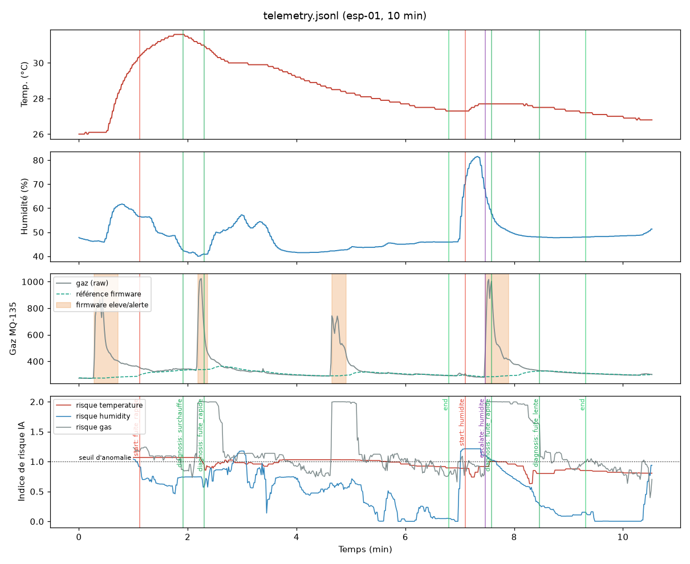

# Évaluation du détecteur d'anomalies Sentinel-X

Modèle entraîné le 2026-10-07T14:04:15+00:00 : 0.0 h réelles, 24 h de normal simulé, 78 h d'incidents simulés.
Toutes les données ci-dessous sont **inédites** pour le modèle (graines de simulation distinctes).

## 1. Fausses alertes en fonctionnement normal

- 47.2 h de fonctionnement normal simulé (dérives de la pièce, passages près du boîtier)
- **7 fausse(s) alerte(s), soit 0.15 par heure**
- Probabilité d'une fausse alerte pendant une démo de 5 min : 1.2%

## 2. Scénarios d'incident

Chaque scénario est tiré 20 fois (pièce, bruit et intensité différents). L'incident commence à t = 600 s. Valeurs : médiane [min – max].

| Scénario | Détection IA | Diagnostic correct | Firmware (eleve/alerte) | Seuil critique atteint | Avance de l'IA sur le seuil |
|---|---|---|---|---|---|
| Surchauffe lente (+0,3 à 0,8 °C/min) | 71 s [31 – 169] (20/20) | 20/20 | jamais (0/20) | 1384 s [889 – 1866] | 1314 s [838 – 1747] |
| Fuite de gaz lente (+5 à 20 /min) | 61 s [35 – 103] (20/20) | 20/20 | jamais (0/20) | 601 s [450 – 1399] | 539 s [401 – 1306] |
| Fuite de gaz franche (+150 à 700 en quelques s) | 7 s [7 – 7] (20/20) | 20/20 | 4 s [1 – 10] (20/20) | 4 s [0 – 9] | -3 s [-7 – 2] |
| Hausse d'humidité (+6 à 35 %) | 15 s [9 – 35] (20/20) | 19/20 | jamais (0/20) | jamais | jamais |
| Scénario de démo : chauffe lente + micro-dérive de gaz | 99 s [69 – 126] (20/20) | 20/20 | jamais (0/20) | 1153 s [907 – 1487] | 1056 s [806 – 1367] |

Seuil critique de référence (jamais utilisé pour détecter) : température ≥ 40 °C, ou concentration réelle ≥ +150 au-dessus de l'air propre (seuil « eleve » du firmware appliqué à la vraie concentration). « jamais » : non atteint pendant les 35 min simulées.

Graphiques : `reports/scenario_<nom>.png`. Détail par tirage : `reports/scenario_<nom>.csv`.

## 3. Enregistrements réels

### telemetry.jsonl — esp-01, 10 min 33 s

| t (s) | Événement IA | Niveau | Capteur | Diagnostic |
|---|---|---|---|---|
| 67 | start | critical | gas | Fuite de gaz franche |
| 115 | diagnosis | critical | temperature | Surchauffe en cours |
| 138 | diagnosis | critical | gas | Fuite de gaz franche |
| 408 | end | info | temperature | Fuite de gaz franche |
| 426 | start | warning | humidity | Hausse d'humidité anormale |
| 448 | escalate | critical | gas | Hausse d'humidité anormale |
| 455 | diagnosis | critical | gas | Fuite de gaz franche |
| 508 | diagnosis | critical | gas | Fuite de gaz lente |
| 559 | end | info | gas | Fuite de gaz lente |

Firmware : 0 s → normal, 17 s → eleve, 18 s → alerte, 30 s → eleve, 44 s → normal, 131 s → eleve, 132 s → alerte, 139 s → eleve, 143 s → normal, 279 s → alerte, 288 s → eleve, 296 s → normal, 448 s → eleve, 449 s → alerte, 460 s → eleve, 475 s → normal

